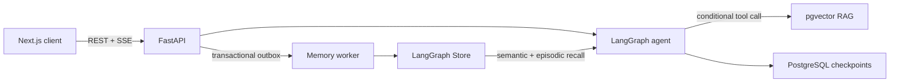

# MindBridge

[](https://github.com/Ex-presso/MindBridge-Agent/actions/workflows/ci.yml)

A stateful mental-health support agent built with FastAPI, LangGraph, and
PostgreSQL. MindBridge combines conditional RAG, deterministic safety routing,
and consent-gated cross-session memory in a full-stack chat application.

## Highlights

- **Stateful agent runtime:** bounded RAG tool routing, PostgreSQL checkpoints,
  token-aware context compaction, and token-level SSE streaming.
- **Long-term memory:** vector-selected episodes and explicit semantic facts,
  with grounded extraction through a leased transactional outbox.
- **Backend safety:** consistent row-lock ordering, idempotent workers,
  deletion barriers, encrypted BYOK credentials, and retry-safe cleanup.
- **Evaluation:** frozen benchmarks for retrieval, routing, response quality,
  safety, and live cross-session memory behavior.

## Architecture



### Agent graph

<picture>
  <source media="(prefers-color-scheme: dark)" srcset="docs/img/agent-graph-dark.svg">
  
</picture>

Safety routing, context compaction, and memory selection are harness decisions,
so recall cannot be skipped by a model that declines to call a tool. The single
agentic choice is whether the turn needs retrieval, measured at F1 = 0.893.

### How one turn becomes durable memory

<picture>
  <source media="(prefers-color-scheme: dark)" srcset="docs/img/memory-write-dark.svg">
  
</picture>

Writing memory means calling an LLM, which is slow and can fail, so the job is
committed with the reply rather than attempted inline. The row lock only covers
the claim; the lease covers the work, which is what makes a crashed worker
recoverable without leaving a job stuck. These invariants are verified against
real PostgreSQL in `backend/tests/test_memory_postgres_integration.py`.

Both figures are generated by [`docs/img/build_diagrams.py`](docs/img/build_diagrams.py).

## Quick Start

Requirements: Docker Compose and an LLM API or local OpenAI-compatible server.

```bash
cp backend/.env.example backend/.env
docker compose up -d
```

Open [localhost:3000](http://localhost:3000), create an account, and add a model
under **Settings**. API documentation is available at
[localhost:8080/docs](http://localhost:8080/docs).

For LM Studio, choose `openai_compatible` and use
`http://host.docker.internal:1234/v1`. Enable long-term memory with
`MEMORY_ENABLED=true`; user consent remains off by default.

Detailed setup, migrations, and memory safety: [docs/MEMORY.md](docs/MEMORY.md).

## Evaluation

All reported runs use frozen datasets committed to the repository. Full
methodology and limitations are documented in
[docs/EVALUATION.md](docs/EVALUATION.md).

| Layer | Result |
|---|---|
| Retrieval | NDCG@5 = 0.537 over a 9-configuration sweep |
| Agent routing | F1 = 0.893 on 45 scored cases |
| Safety | Self-harm crisis referral improved from 0% to 100% on 20 probes |
| Live memory | 4/6 recall with memory on, 0/6 off, and 5/5 privacy/selection gates |

```bash
cd evaluation && uv sync --locked
uv run python eval_routing.py --max-queries 3
uv run python eval_memory.py --max-recall 1 --skip-gates
```

## Repository

```text
backend/        FastAPI, LangGraph, PostgreSQL, memory worker
frontend-next/  Next.js chat and privacy controls
evaluation/     Frozen benchmarks and reproducible runners
analysis/       Evaluation figures and tables
docs/           Architecture, evaluation, and memory design
```

## Documentation

- [Evaluation](docs/EVALUATION.md)
- [Memory architecture](docs/MEMORY.md)

## License

Educational and research use.
