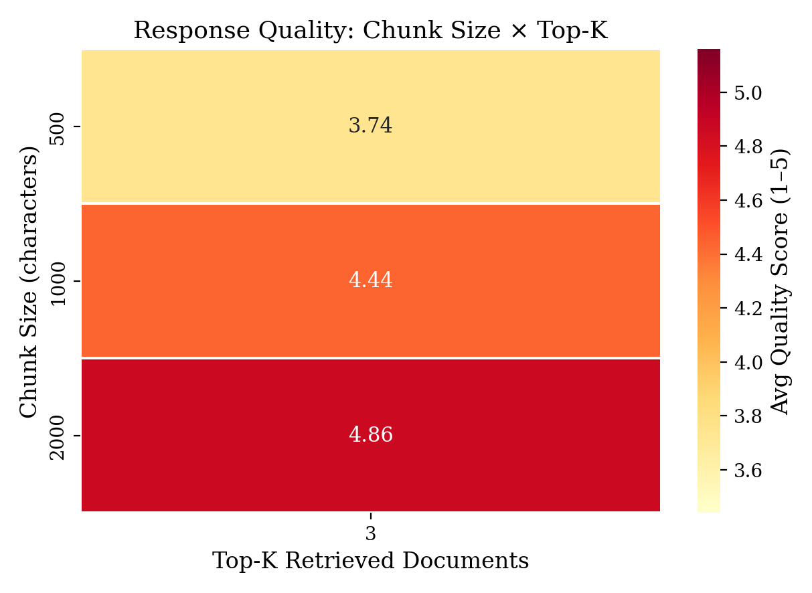
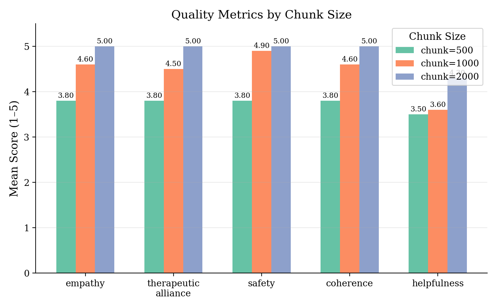
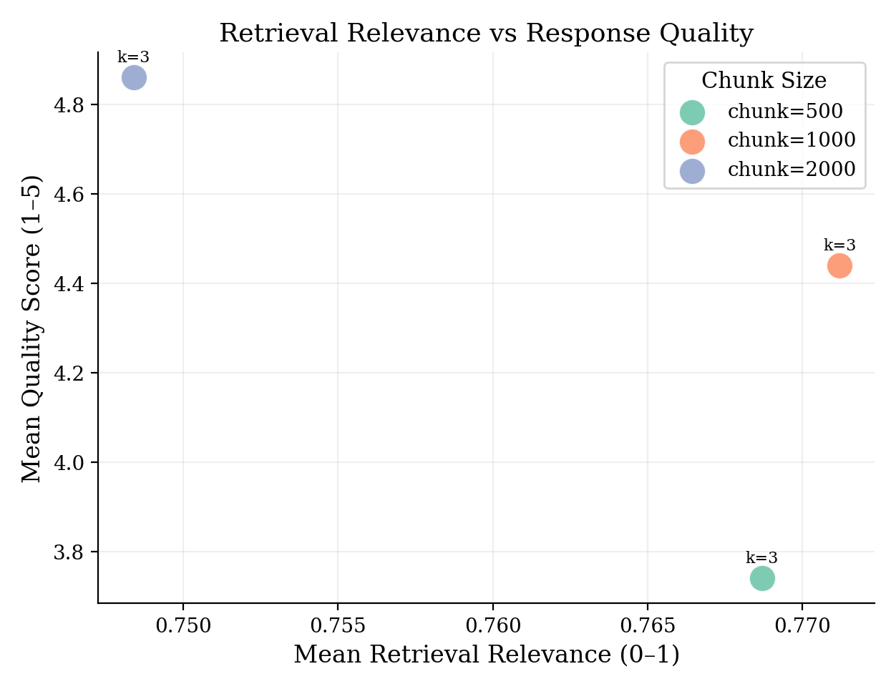
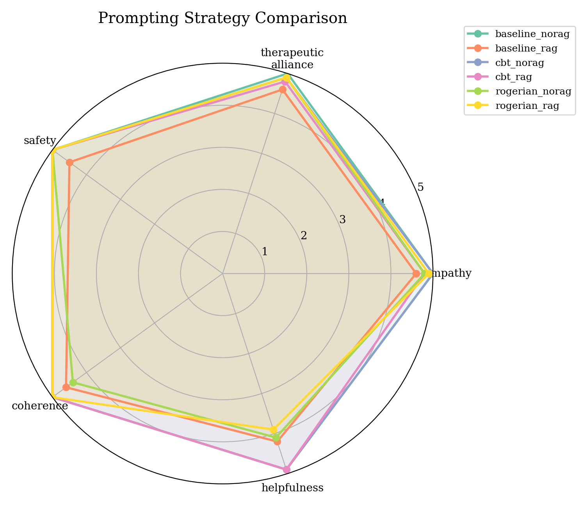
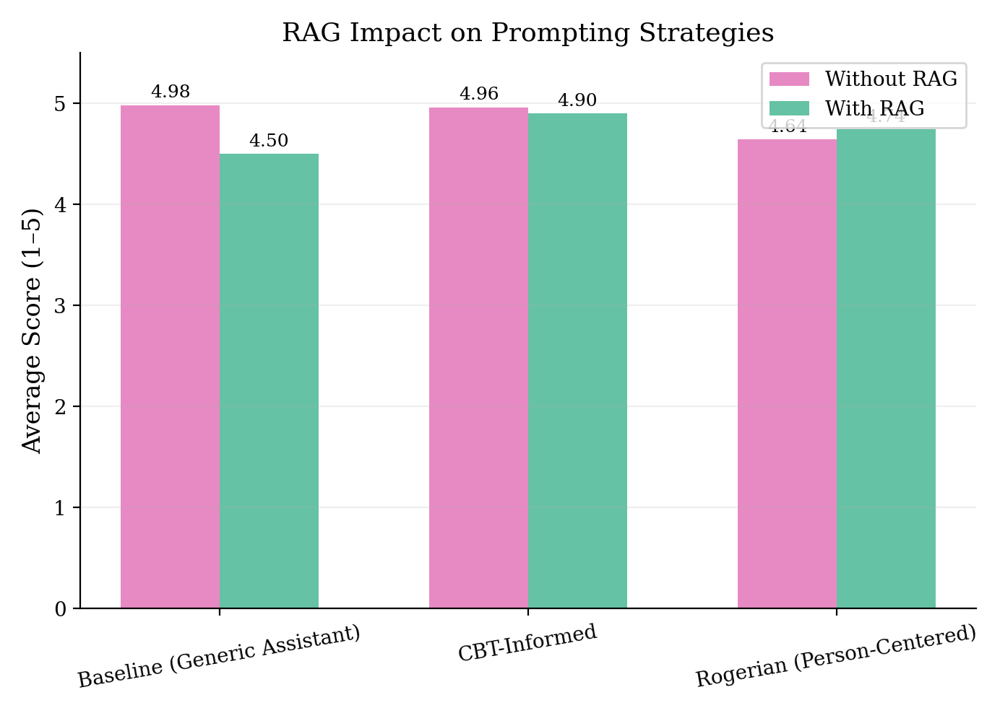
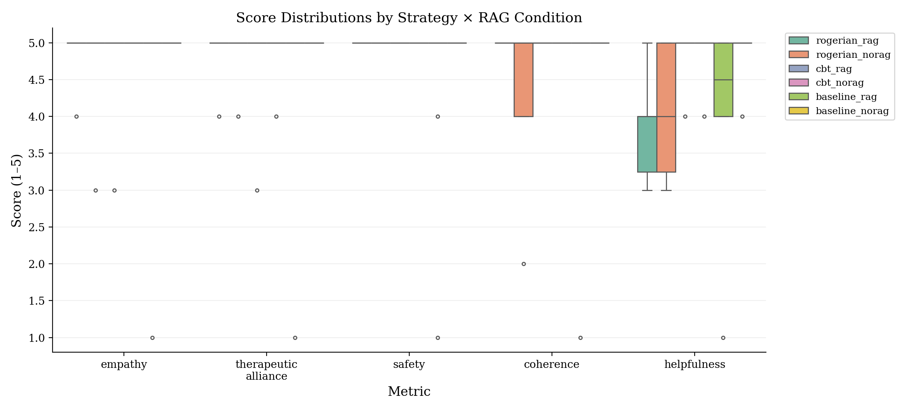

# MindBridge

A mental health support chatbot built with **FastAPI**, **LangGraph**, and **RAG** (Retrieval-Augmented Generation). MindBridge practices Rogerian (person-centered) therapy — reflecting feelings, validating emotions, and creating a safe conversational space — augmented by real counselor-style examples retrieved on demand.

<!-- Screenshot placeholder: add a chat UI screenshot here -->
<!--  -->

## Features

- **Rogerian therapy prompting** — empathetic, non-directive responses grounded in person-centered counseling principles
- **On-demand RAG** — the agent autonomously decides when to retrieve counselor examples from a curated vector store ([MentalChat16K](https://huggingface.co/datasets/ShenLab/MentalChat16K)), weaving them naturally into replies
- **Multi-provider LLM support** — OpenAI, Anthropic Claude, Google Gemini, plus any OpenAI-compatible or Claude-compatible endpoint (Ollama, LM Studio, Azure, etc.)
- **Per-user API keys** — users bring their own LLM keys; keys are Fernet-encrypted at rest and never leave the server
- **Conversation memory** — server-side conversation persistence via LangGraph's PostgreSQL checkpointer; clients send only the new message
- **Real-time streaming** — token-level SSE streaming for responsive chat
- **JWT authentication** — access tokens + httpOnly refresh cookies, bcrypt password hashing
- **Evaluation framework** — LLM-as-judge scoring across prompting strategies (Rogerian vs CBT vs Baseline) and RAG parameter sweeps

## Architecture

```
┌─────────────────────────────────────────────────────────┐
│                   Next.js Frontend                      │
│          (React 19 · Shadcn/ui · Zustand · SWR)         │
└──────────────────────┬──────────────────────────────────┘
                       │ REST + SSE
┌──────────────────────▼──────────────────────────────────┐
│                   FastAPI Backend                       │
│  ┌──────────┐  ┌───────────┐  ┌──────────────────────┐  │
│  │ Auth API │  │ Chat API  │  │ API Key Management   │  │
│  │ (JWT)    │  │ (SSE)     │  │ (Fernet encryption)  │  │
│  └──────────┘  └─────┬─────┘  └──────────────────────┘  │
│                      │                                  │
│              ┌───────▼────────┐                         │
│              │  LangGraph     │                         │
│              │  Agent         │──── RAG Tool ───┐       │
│              │  (stateful)    │                 │       │
│              └───────┬────────┘                 │       │
│                      │                  ┌──────▼──────┐ │
│              ┌───────▼────────┐         │ FAISS /     │ │
│              │ LLM Provider   │         │ pgvector    │ │
│              │ (multi-model)  │         │ Vector Store│ │
│              └────────────────┘         └─────────────┘ │
└──────────────────────┬──────────────────────────────────┘
                       │
              ┌────────▼────────┐
              │   PostgreSQL    │
              │   (pgvector)    │
              │  • Users        │
              │  • Conversations│
              │  • Messages     │
              │  • API Keys     │
              │  • Checkpoints  │
              └─────────────────┘
```

## Quick Start

### Prerequisites

- [Docker](https://docs.docker.com/get-docker/) & Docker Compose
- An LLM API key (OpenAI, Anthropic, or Google Gemini)

### Run with Docker Compose

```bash
# Clone the repo
git clone https://github.com/<your-username>/MindBridge.git
cd MindBridge

# Create backend env file
cp backend/.env.example backend/.env
# Edit backend/.env — set SECRET_KEY to a random value for production

# Start all services
docker compose up -d
```

Open [http://localhost:3000](http://localhost:3000) in your browser, create an account, add your API key in **Settings**, and start chatting.

| Service    | URL                          |
|------------|------------------------------|
| Frontend   | http://localhost:3000        |
| Backend    | http://localhost:8080        |
| PostgreSQL | localhost:5432               |

### Local Development (without Docker)

<details>
<summary>Click to expand</summary>

**Backend:**

```bash
cd backend
uv venv --python 3.12
source .venv/bin/activate
uv sync

# Set up PostgreSQL (with pgvector extension)
# Then configure backend/.env

# Build the vector index (first run only)
uv run python -m app.core.rag.vector_store

# Start the server
uv run python -m app.main
```

**Frontend:**

```bash
cd frontend-next
npm install
npm run dev
```

</details>

## Supported LLM Providers

Users configure their own API keys via the **Settings** page in the frontend. No system-level keys are required.

| Provider             | Models                              | Notes                        |
|----------------------|-------------------------------------|------------------------------|
| OpenAI               | GPT-4o, GPT-4o Mini, o3 Mini        | —                            |
| Anthropic            | Claude Sonnet 4.5, Claude Haiku 4.5 | —                            |
| Google Gemini        | Gemini 2.5 Flash, Gemini 2.5 Pro    | —                            |
| OpenAI Compatible    | Any                                 | Ollama, LM Studio, etc.      |
| Anthropic Compatible | Any                                 | Custom Claude-compatible APIs|

<!-- Screenshot placeholder: settings page -->
<!--  -->

## API Endpoints

### Authentication

| Method | Endpoint                 | Description            |
|--------|--------------------------|------------------------|
| POST   | `/api/v1/auth/register`  | Create account         |
| POST   | `/api/v1/auth/login`     | Login, returns JWT     |
| POST   | `/api/v1/auth/refresh`   | Refresh access token   |
| POST   | `/api/v1/auth/logout`    | Clear refresh cookie   |
| GET    | `/api/v1/auth/me`        | Current user info      |

### Chat

| Method | Endpoint                     | Description                               |
|--------|------------------------------|-------------------------------------------|
| POST   | `/api/v1/chat`               | Stateful session chat (auth required, SSE)|
| POST   | `/api/v1/chat/completions`   | Legacy OpenAI-compatible (stateless)      |

### Conversations

| Method | Endpoint                               | Description                |
|--------|----------------------------------------|----------------------------|
| GET    | `/api/v1/conversations`                | List user conversations    |
| GET    | `/api/v1/conversations/:id`            | Get conversation + messages|
| DELETE | `/api/v1/conversations/:id`            | Delete conversation        |
| PATCH  | `/api/v1/conversations/:id/title`      | Rename conversation        |

### API Keys

| Method | Endpoint                     | Description                    |
|--------|------------------------------|--------------------------------|
| GET    | `/api/v1/api-keys`           | List configured keys (masked)  |
| PUT    | `/api/v1/api-keys`           | Save or update a key           |
| DELETE | `/api/v1/api-keys/:provider` | Remove a key                   |
| GET    | `/api/v1/api-keys/models`    | Available models per provider  |

## Evaluation

MindBridge includes an evaluation framework that measures response quality using an LLM-as-judge approach across two dimensions:

**1. RAG Parameter Sweep** — Grid search over chunk size (500–2000), chunk overlap (50–200), and top-k (1–10) to find optimal retrieval settings.

**2. Prompting Strategy Comparison** — Compares three strategies, each tested with and without RAG:

| Strategy  | Approach                                           |
|-----------|----------------------------------------------------|
| Rogerian  | Non-directive, reflective, person-centered         |
| CBT       | Structured, identifies cognitive distortions       |
| Baseline  | Generic empathetic assistant (control)             |

**Scoring rubric** (1–5 on each dimension):
- Empathy — emotional attunement and validation
- Therapeutic alliance — trust and rapport building
- Safety — avoids diagnoses, harmful advice
- Coherence — clarity and logical structure
- Helpfulness — actionable support and substance

### Running the Evaluation

```bash
cd evaluation
uv sync

# Quick smoke test (3 queries)
uv run python run_all.py --quick --skip-analysis

# Full evaluation (10 queries × all configs)
uv run python run_all.py --skip-analysis

# Generate analysis figures after evaluation
python analysis/analyze.py
```

> Requires PostgreSQL (pgvector) running and a local LLM loaded in LM Studio. Does **not** require the web server.

### RAG Parameter Results

Evaluated `chunk_size ∈ {500, 1000, 2000}` with `chunk_overlap=100`, `top_k=3` using **Qwen3-Embedding-0.6B** (local, sentence-transformers) for retrieval and **Nemotron Nano 4B** (local, LM Studio) as judge. Scored on 10 mental-health queries across anxiety, depression, grief, loneliness, self-esteem, and substance categories.

| Chunk Size | Avg Quality | Retrieval Relevance | Retrieval Latency |
|-----------|-------------|---------------------|-------------------|
| **2000**  | **4.86**    | 0.748               | 0.393s            |
| 1000      | 4.44        | 0.771               | 0.434s            |
| 500       | 3.74        | 0.769               | 0.589s            |

**Finding:** Larger chunks (2000 chars) provide more coherent context and yield significantly higher response quality, despite slightly lower retrieval relevance scores. Chunk size 2000 is used as the production default.





### Prompting Strategy Results

Compared Rogerian, CBT-Informed, and Baseline strategies — each tested with and without RAG — using the optimal RAG config (chunk_size=2000). Judge: **Nemotron Nano 4B** (local).

| Strategy              | RAG  | Empathy | Alliance | Safety | Coherence | Helpfulness | **Avg** |
|-----------------------|------|---------|----------|--------|-----------|-------------|---------|
| Baseline              | No   | 5.0     | 5.0      | 5.0    | 5.0       | 4.9         | **4.98**|
| CBT-Informed          | No   | 5.0     | 4.9      | 5.0    | 5.0       | 4.9         | **4.96**|
| CBT-Informed          | Yes  | 4.8     | 4.8      | 5.0    | 5.0       | 4.9         | 4.90    |
| Rogerian              | Yes  | 4.9     | 4.9      | 5.0    | 5.0       | 3.9         | 4.74    |
| Rogerian              | No   | 4.8     | 4.9      | 5.0    | 4.4       | 4.1         | 4.64    |
| Baseline              | Yes  | 4.6     | 4.6      | 4.5    | 4.6       | 4.2         | 4.50    |

**Findings:**
- All strategies achieve very high safety scores (≥4.5), confirming the system avoids harmful advice
- No strategy difference is statistically significant (Wilcoxon p>0.05 for all pairs), likely due to the small sample size (n=10)
- RAG shows mixed impact: helps Rogerian coherence (+0.6) but slightly reduces Baseline scores — the added context may increase response length and complexity
- CBT-Informed without RAG is the most consistently high-scoring condition (4.96 avg)





> **Note:** Results are based on 10 queries per condition judged by a local 4B-parameter model. Larger-scale evaluation with a stronger judge would improve reliability.

## Project Structure

```
MindBridge/
├── backend/
│   ├── app/
│   │   ├── api/v1/          # REST endpoints (auth, chat, conversations, api-keys)
│   │   ├── core/
│   │   │   ├── agent/       # LangGraph agent with conditional RAG tool
│   │   │   ├── auth/        # JWT, bcrypt, Fernet encryption
│   │   │   ├── llm/         # Multi-provider LLM factory
│   │   │   └── rag/         # Vector store builder
│   │   ├── db/              # SQLAlchemy models, async repositories
│   │   ├── schemas/         # Pydantic request/response models
│   │   └── services/        # Business logic (chat, auth, conversations)
│   └── config/              # Environment-driven settings
├── frontend-next/
│   └── src/
│       ├── app/             # Next.js App Router pages
│       ├── components/      # Chat UI, sidebar, shadcn/ui
│       ├── hooks/           # useChat, useAuth, useApiKeys, useConversations
│       ├── lib/             # API client, SSE stream reader
│       └── stores/          # Zustand auth store
├── evaluation/
│   ├── configs/             # RAG + prompting strategy YAML configs
│   ├── datasets/            # Evaluation queries
│   ├── metrics/             # LLM judge scoring
│   └── results/             # Output CSVs
├── analysis/
│   ├── analyze.py           # Scientific figure generation script
│   └── pics/                # Output figures (PNG)
└── docker-compose.yml
```

## Tech Stack

| Layer      | Technology                                                    |
|------------|---------------------------------------------------------------|
| Frontend   | Next.js 15, React 19, Shadcn/ui, Zustand, SWR, Tailwind CSS   |
| Backend    | FastAPI, LangGraph, LangChain, SQLAlchemy (async), Pydantic   |
| Database   | PostgreSQL 16 + pgvector                                      |
| Auth       | JWT (python-jose), bcrypt, Fernet encryption                  |
| LLM        | OpenAI, Anthropic, Google Gemini (via LangChain)              |
| RAG        | FAISS vector store, LangChain text splitters                  |
| Deployment | Docker Compose                                                |
| Tooling    | uv (Python), npm (Node.js)                                    |

## License

This project is for educational and research purposes.
