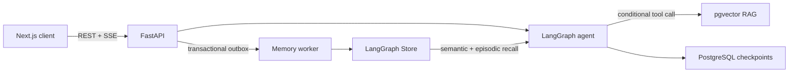
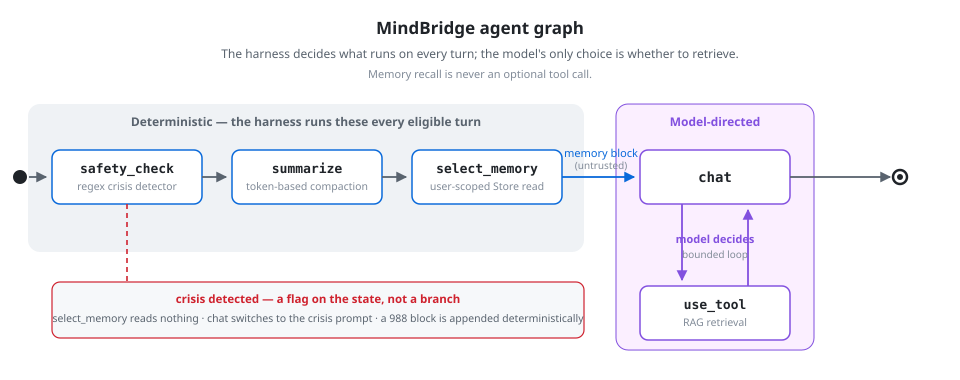
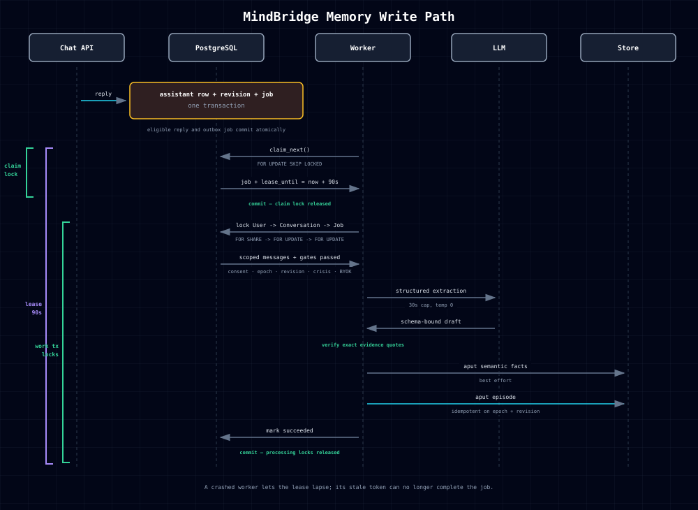

# MindBridge

[](https://github.com/Ex-presso/MindBridge-Agent/actions/workflows/ci.yml)

A stateful mental-health support agent built with FastAPI, LangGraph, and
PostgreSQL. MindBridge combines conditional RAG, deterministic safety routing,
and consent-gated cross-session memory in a full-stack chat application.

## Highlights

- **Stateful agent runtime:** bounded RAG tool routing, PostgreSQL checkpoints,
  token-aware context compaction, and token-level SSE streaming.
- **Long-term memory:** vector-selected episodes and explicit semantic facts,
  with grounded extraction through a leased transactional outbox.
- **Backend safety:** consistent row-lock ordering, idempotent workers,
  deletion barriers, encrypted BYOK credentials, and retry-safe cleanup.
- **Evaluation:** frozen routing and safety benchmarks plus live API-level
  cross-session memory acceptance.

## Architecture



### Agent graph



Safety routing, context compaction, and memory selection are application
decisions, so recall cannot be skipped by a model that declines to call a tool.
The single graph-routing choice is whether the turn needs retrieval, measured at
F1 = 1.000 on the frozen 45-case benchmark.

[Open the self-contained agent diagram](docs/img/skill/agent-graph.html) to use
its PNG/PDF export controls after cloning the repository.

## Memory

Durable memory is written automatically, with memory policy kept outside model
control:

- **Selection** reads exact semantic facts and vector-ranked episodes before
  each eligible turn; recalled content is treated as untrusted user data.
- **Extraction** creates evidence-grounded episodes and promotes only explicit
  user statements into semantic memory.
- **Durability** moves LLM work off the request path through a PostgreSQL
  transactional outbox, leased worker, and idempotent Store writes.
- **Privacy** gates every read and write on consent, data epoch, revision, crisis
  state, and deletion barriers. Memory is disabled by default.

### Write path



The eligible assistant reply and outbox job commit atomically. A worker claims
the job with `FOR UPDATE SKIP LOCKED`, then re-locks
`User -> Conversation -> Job` while it revalidates privacy gates, calls the
extractor, and writes semantic and episodic memory. The lease is also the
ownership token, so a crashed or stale worker cannot overwrite a newer claim.

[Open the self-contained memory diagram](docs/img/skill/memory-write.html) to
export it after cloning. Full invariants and scope are in
[docs/MEMORY.md](docs/MEMORY.md).

## Quick Start

Requirements: Docker Compose and an LLM API or local OpenAI-compatible server.

```bash
cp backend/.env.example backend/.env
docker compose up -d
```

Open [localhost:3000](http://localhost:3000), create an account, and add a model
under **Settings**. API documentation is available at
[localhost:8080/docs](http://localhost:8080/docs).

The default is DeepSeek V4 Flash through `openai_compatible`; enter your API key
with `https://api.deepseek.com` and `deepseek-v4-flash` in **Settings**.
For LM Studio, choose `openai_compatible` and use
`http://host.docker.internal:1234/v1`. Enable long-term memory with
`MEMORY_ENABLED=true`; user consent remains off by default.

Detailed setup, migrations, and memory safety: [docs/MEMORY.md](docs/MEMORY.md).

## Evaluation

All reported runs use frozen datasets committed to the repository. Full
methodology and limitations are documented in
[docs/EVALUATION.md](docs/EVALUATION.md).

| Capability | Frozen scope | Result |
|---|---:|---|
| RAG tool routing | 45 scored hand-labeled cases | Precision, recall, and F1 = **1.000** |
| Safety behavior | 20 frozen probes | **20/20 passed**, including 6/6 crisis referrals |
| Cross-session memory | 24 live API cases | **24/24 passed**: 6 episodic pairs, 4 Semantic kinds, 8 hard gates |
| Browser product path | Registration → BYOK → memory → cross-session recall → deletion | **Passed** |

These are bounded acceptance results, not general model-quality claims.

```bash
cd evaluation
uv run --project ../backend python eval_routing.py --max-queries 3
uv run --project ../backend python eval_memory.py --max-recall 1 --skip-gates
```

## Repository

```text
backend/        FastAPI, LangGraph, PostgreSQL, memory worker
frontend-next/  Next.js chat and privacy controls
evaluation/     Frozen benchmarks and reproducible runners
docs/           Architecture, evaluation, and memory design
```

## Documentation

- [Evaluation](docs/EVALUATION.md)
- [Memory architecture](docs/MEMORY.md)

## License

Educational and research use.
